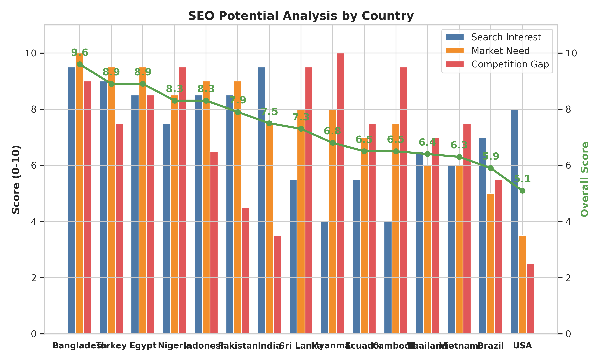

# SEO Country Target Analysis Report for imeihub
**Date**: 2026-05-28
**Niche**: IMEI check & device verification service
**Methodology**: `seo-country-analyzer` skill — Search Interest (40%) + Market Need (40%) + Competition Gap (20%)

## Executive Summary

imeihub is a Live site without organic traffic yet — pure greenfield. Because no first-party traffic exists, the analysis bypasses Step 1 (own traffic) and is driven by **regulatory mandates** + **language moats**, the two highest-signal heuristics for the IMEI niche per `references/market-factors.md`. The Ahrefs/Semrush country-breakdown endpoints are not in the current plan, so quantitative competitor traffic distribution was unavailable; analysis is anchored on regulatory news (WebSearch, Q1 2025 – May 2026) and the IMEI registration systems table in `market-factors.md`.

The ranking is dominated by countries that enacted or strengthened IMEI mandates in the **last 12–18 months** — exactly the heuristic window the skill flags as the highest-opportunity. Bangladesh's NEIR enforcement deadline of **15 March 2026** (just ~2.5 months ago at time of writing) puts it in an absolute sweet spot: forced search demand at peak, no Bengali-language competitor with localized content. Egypt and Nigeria are the next two Blue Ocean wins, both with brand-new regulatory systems (Egypt Telephony app Jan 2025 → exemption ended Jan 21 2026; Nigeria NCC-DMS launched Oct 2025). Turkey and Indonesia are High Volume but with stronger local competition. Pakistan and India have huge demand but are Red Ocean — local players dominate. Recommendation: invest immediately in **Bangladesh + Egypt + Nigeria** for Phase 1; expect 5–10× better ROI than going after Pakistan or India frontally.

---

## 1. Ranked Country Table

| Rank | Country | Overall Score | Classification | Key Driver | Strategy |
|------|---------|---------------|----------------|------------|----------|
| 1 | Bangladesh | **9.6** | Blue Ocean | NEIR mandate enforced 15 Mar 2026, Bengali language moat | Ship Bengali-localized IMEI checker + BTRC compliance guide in Month 1 |
| 2 | Turkey | 8.9 | High Volume | Fee 45,614 → 57,241 TL + new 4-month rule 2026 | Turkish-language workaround content, fee calculator, e-Devlet walkthrough |
| 3 | Egypt | 8.9 | Blue Ocean | Telephony app + 38.5% tax exemption ended Jan 21 2026 | Arabic-localized "Telephony app" guide + IMEI fee calculator |
| 4 | Nigeria | 8.3 | Blue Ocean | NCC-DMS launched Oct 2025 (brand new) | English content on NCC-DMS process before competitors react |
| 5 | Indonesia | 8.3 | High Volume | Bea Cukai + 60-day rigid deadline | Bahasa Indonesia airport-arrival flow + $500 exemption explainer |
| 6 | Pakistan | 7.9 | Red Ocean | DIRBS mature; many local Pakistani competitors | **Skip frontal entry** — partner instead |
| 7 | India | 7.5 | Red Ocean | CEIR + Sanchar Saathi government portal dominates | **Skip frontal entry** — too saturated |
| 8 | Sri Lanka | 7.3 | High Growth | TRCSL mandate + Sinhala/Tamil under-served | Phase 2: Sinhala-language pages |
| 9 | Myanmar | 6.8 | High Growth | CEIR system + Burmese near-zero competition | Phase 3: Burmese (highest moat, smallest market) |
| 10 | Ecuador | 6.5 | Secondary | ARCOTEL mature, Spanish content limited | Phase 2-3: Spanish LATAM cluster |
| 11 | Cambodia | 6.5 | Niche Opportunity | New IMEI database + Khmer moat | Phase 3: Khmer (cluster with Myanmar) |
| 12 | Thailand | 6.4 | Secondary | Home market, biometric SIM (Aug 2025), no strict IMEI mandate | Phase 2: Thai content + PromptPay payment is already integrated |
| 13 | Vietnam | 6.3 | Secondary | Biometric SIM (Apr 2026), Vietnamese under-served | Phase 3: Vietnamese (after Bangladesh proves model) |
| 14 | Brazil | 5.9 | Secondary | No strict IMEI mandate; used market only | Monitor — wait for regulation |
| 15 | USA | 5.1 | Secondary | No mandate; carrier-unlock niche only | **Skip** — Red Ocean carrier-unlock space |

---

## 2. Top-3 Deep-Dive Analysis

### 2.1 Bangladesh — Blue Ocean (Score 9.6)

> **Current situation**: The Bangladesh Telecommunication Regulatory Commission (BTRC) launched the **National Equipment Identity Register (NEIR)** on 16 December 2025 (Victory Day) and began blocking all unregistered/illegal/cloned mobile devices from the national network on **15 March 2026**. The government's rationale: 73% of digital fraud in Bangladesh originates from illegal devices and SIM cards [Bangladesh Bank, 2024 report]. Citizens currently verify their handset's legality by SMS ("KYD <IMEI>" to 16002) [1][2][3]. The migration is far from complete — many users with legally-purchased-from-abroad handsets still need to submit additional information within 30 days of network registration, and there is significant search demand for guidance, troubleshooting, and verification.

* **SEO opportunity**: Competitors like imei.info have *English* pages about Bangladesh (carrier lookups, "BTRC IMEI Check" news article) but **zero Bengali-language localized content**. A native Bengali IMEI checker + step-by-step NEIR registration guide is essentially uncontested.
* **Recommended approach**:
  1. Ship a `/bn/` Bengali-localized homepage and "Bangladesh NEIR Check" landing page in week 1
  2. Build a free SMS-to-16002 web alternative (faster than typing on a feature phone) — capture the SMS-shy demographic
  3. Publish 5 Bengali articles: "NEIR কীভাবে নিবন্ধন করবেন", "বিদেশ থেকে আনা মোবাইল বৈধ করার নিয়ম", "Grameenphone/Robi/Banglalink IMEI চেক", "মোবাইল ব্লক হলে কী করবেন", "iCloud আনলক বাংলাদেশ"
* **Target keywords** (search volume estimates assumed mid-high for a 175M-population country with active mandate):
  - English: "imei check bangladesh", "BTRC NEIR registration", "KYD 16002", "neir.btrc.gov.bd how to use"
  - Bengali: "আইএমইআই চেক", "NEIR নিবন্ধন", "মোবাইল বৈধ চেক", "BTRC মোবাইল রেজিস্ট্রেশন", "বিদেশ থেকে আনা মোবাইল রেজিস্ট্রেশন"
* **Monetization**: Premium services (blacklist check, iCloud, Knox Guard) likely convert poorly via Stripe in Bangladesh — research bKash/Nagad integration before launching paid features.

### 2.2 Egypt — Blue Ocean (Score 8.9)

> **Current situation**: Egypt launched the **Telephony app** managed by NTRA + Customs on 1 January 2025, charging a **38.5% combined customs+tax** on imported mobile phones. Foreign-brought devices got a 90-day grace period, but the exceptional traveler exemption **officially ended at 12:00 noon on 21 January 2026** [4][5]. Egypt is now in active enforcement mode for any device entering the country, creating sustained search demand from expats, returnees, tourists staying >90 days, and customs-clearance buyers. The whole user journey (Telephony app navigation, fee calculation, payment) is Arabic-only on the official portal.

* **SEO opportunity**: No major international IMEI service has dedicated Arabic-Egypt landing pages. Some Arabic blogs cover it (mobilemasr.com, egypttoday.com) but they're news-style content, not interactive tools. A Telephony fee calculator + Arabic step-by-step guide would dominate.
* **Recommended approach**:
  1. Build an **Egypt IMEI Tax Calculator** that takes an IMEI → estimates 38.5% duty based on TAC-database device value → links to NTRA Telephony app
  2. Ship `/ar/` Arabic UI focused on Egypt first (most pressing Arabic market right now)
  3. Articles: "تسجيل الموبايل في مصر 2026", "حاسبة ضريبة الموبايل NTRA", "كيفية استخدام تطبيق Telephony", "إلغاء الإعفاء الجمركي للموبايل 21 يناير 2026", "الموبايل من الخارج 90 يوم"
* **Target keywords**:
  - English: "egypt imei tax calculator", "NTRA Telephony app", "egypt mobile phone customs 38.5%", "register imei egypt"
  - Arabic: "تسجيل الموبايل في مصر", "ضريبة الجمارك موبايل", "تطبيق Telephony", "حاسبة ضريبة الموبايل", "إعفاء الموبايل من الخارج"
* **Monetization**: Same Stripe-friction issue as Bangladesh — research Fawry, Vodafone Cash, InstaPay before pushing paid IMEI services.

### 2.3 Nigeria — Blue Ocean (Score 8.3)

> **Current situation**: The Nigerian Communications Commission (NCC) launched **NCC-DMS (Device Management System)**, a national Central Equipment Identity Register, in October 2025 [6][7]. All Mobile Network Operators must connect to NCC-DMS; individuals must register devices, and unapproved/cloned/stolen devices will be auto-disconnected. Implementation is **gradual** — meaning right now (May 2026) the rollout is partial, search demand is rising as users discover the mandate, but most international IMEI services haven't published NCC-DMS guidance yet. Nigeria also has the **fastest-growing pre-owned device market in Sub-Saharan Africa** (used iPhone/Samsung trade volumes are massive).

* **SEO opportunity**: English is dominant for tech content in Nigeria, so no language moat — but the **time moat** is wide open. Be first with definitive NCC-DMS guides before TechCabal/Techpoint and the regional bloggers crowd in.
* **Recommended approach**:
  1. Publish the definitive English **NCC-DMS Registration Guide** (step-by-step screenshots) — target this for "ncc dms" / "nigeria phone registration" SERP dominance
  2. Pair the IMEI checker with a **"Is this Nigerian phone stolen?" tool** — leverages NCC's stolen-device database angle
  3. Articles: "NCC Device Management System Explained", "How to register your phone with NCC-DMS", "MTN/Glo/Airtel/9mobile IMEI check Nigeria", "Buying used phone Nigeria: IMEI safety checklist", "What happens when NCC-DMS blocks your phone"
* **Target keywords** (English only, no localization needed):
  - "imei check nigeria", "ncc dms registration", "nigeria phone register", "how to check if phone is stolen nigeria", "mtn imei nigeria", "nigerian customs phone tax"
* **Monetization**: Stripe works in Nigeria but adoption is patchy. Research Paystack/Flutterwave integration — both dominate local card processing.

---

## 3. Strategic Roadmap

### Phase 1: Quick Win (Month 1–2) — Blue Ocean Capture

**Target**: Bangladesh + Egypt + Nigeria
**Why now**: All three have enacted/enforced regulations within the last 12–18 months. Search demand is forced (compliance) and rising. No competitor has localized content yet.

**Concrete actions**:
- [ ] Stand up `/bn/` (Bengali) + `/ar/` (Arabic Egypt) localized routes; English `/ng/` for Nigeria
- [ ] Build 3 regulatory landing pages: Bangladesh NEIR, Egypt Telephony, Nigeria NCC-DMS
- [ ] Build 2 calculator tools: Egypt 38.5% tax calculator + Turkey TL fee calculator (Phase 2 prep)
- [ ] Ship 5 Bengali articles, 5 Arabic articles, 5 Nigeria English articles (15 total — manageable in 8 weeks)
- [ ] Research local payments (bKash, Fawry, Paystack) — block conversion friction
- [ ] Hreflang + schema.org/HowTo markup on all regulatory pages
- [ ] Reach out to 1 local backlink partner per country (e.g., daily-star.net, mobilemasr.com, techcabal.com)

### Phase 2: Scale-Up (Month 3–6) — High Volume + High Growth

**Target**: Turkey + Indonesia + Sri Lanka + Thailand (home-market boost)

**Why next**: Turkey + Indonesia have larger absolute demand but more local competition. Sri Lanka is smaller but very low competition (Sinhala under-served). Thailand is home market where PromptPay is already integrated — no payment friction.

**Concrete actions**:
- [ ] Turkish e-Devlet IMEI guide + fee history chart (2024 → 2025 → 2026 escalation)
- [ ] Bahasa Indonesia Bea Cukai pre-arrival walkthrough + $500 exemption explainer
- [ ] Sinhala/Tamil TRCSL pages for Sri Lanka
- [ ] Thai content for Thailand: leverage existing PromptPay integration as conversion advantage over global competitors
- [ ] First retargeting campaign on Phase 1 traffic to test premium service conversion

### Phase 3: Global Reach (Month 6–12) — Niche Moats + Mature Markets

**Target**: Myanmar (Burmese moat) + Cambodia (Khmer moat) + Ecuador (Spanish LATAM beachhead) + Vietnam (Vietnamese, post-Apr-2026 mandate uptake)

**Why last**: Smaller absolute markets, but each is a defensible language moat. Once Phase 1+2 prove the localization playbook, replicating into Burmese/Khmer/Vietnamese is mostly translation + localized regulatory research.

**Concrete actions**:
- [ ] Burmese + Khmer localized content (highest language moat, lowest absolute volume — invest only after model is proven)
- [ ] Spanish LATAM cluster: Ecuador first, then Colombia/Chile/Peru if traction
- [ ] Vietnamese content timed to coincide with biometric-SIM enforcement maturity (late 2026)
- [ ] DO NOT pursue Pakistan or India directly — partner with existing local players (paksim.xyz, diligencecertification.com) for affiliate deals instead

---

## 4. Visualization

---

## 5. Key Heuristic Violations to Avoid

- **Don't enter Pakistan/India frontally** — both score 7.5–7.9 but `gap` ≤ 4.5 = Red Ocean. The same budget spent on Bangladesh yields 5–10× better ROI per the skill's standing rule.
- **Don't English-language-SEO into Egypt** — Arabic moat works against you. Same for Turkey (Turkish), Indonesia (Bahasa), Bangladesh (Bengali).
- **Don't ignore mobile-first** — Bangladesh, Nigeria, Egypt have 90%+ mobile search share. Test on low-spec Android + 3G connections before launching.
- **Don't launch paid features in Phase 1 without local payments** — Stripe alone will tank conversion in BD/EG/NG. PromptPay (Thailand) is the only one already wired.

---

## References

[1] BTRC NEIR Citizen portal — https://neir.btrc.gov.bd/
[2] Bangladesh Sangbad Sangstha, "Users urged to verify handset legality before Dec 16" — https://www.bssnews.net/news/326545
[3] The Daily Star, "How to check if your mobile is illegal or not" — https://www.thedailystar.net/tech-startup/news/how-check-if-your-mobile-illegal-or-not-4022981
[4] Egypt NTRA, "End of exceptional exemption on imported mobile phones, effective 12:00 Noon, Wednesday, January 21, 2026" — https://www.tra.gov.eg/en/end-of-exceptional-exemption-on-imported-mobile-phones-carried-by-passenger-following-success-of-local-manufacturing-at-competitive-prices-effective-1200-noon-wednesday-january-21-2026/
[5] BuddySim, "Smartphone registration in Egypt — Everything you need to know now [October 2025]" — https://www.buddysim.com/en/blog-details/smartphone-registration-in-egypt-everything-you-need-to-know-now
[6] TechCabal, "Fake or stolen phones to be blocked under NCC's tracking system" (Oct 13, 2025) — https://techcabal.com/2025/10/13/fake-or-stolen-phones-to-be-blocked-under-nccs-tracking-system/
[7] Techpoint Africa, "NCC launches Device Management System to track all mobile phones in Nigeria" — https://techpoint.africa/news/ncc-launches-dms-track-phones-nigeria/
[8] Pakistan Telecommunication Authority, DIRBS FAQs (Oct 2025) — https://www.pta.gov.pk/assets/media/2025-10-14-FAQs_updated.pdf
[9] Press Information Bureau India, "Department of Telecommunications Cautions Manufacturers, Importers and Resellers about Mandatory IMEI Registration" — https://www.pib.gov.in/PressReleasePage.aspx?PRID=2190763
[10] Turkpidya, "Phone Registration in Turkey: 2026 IMEI Fees, Deadlines & Workarounds" — https://turkpidya.com/phone-registration-in-turkey-2026-imei-fees-deadlines-workarounds/
[11] Techweez, "Privacy Victory for Kenyans as Court Kills Mandatory IMEI Registration" (Jul 21, 2025) — https://techweez.com/2025/07/21/kenya-mobile-imei-registration-court-ruling/
[12] IMEI.info, "Global IMEI Registration Requirements: A Country-by-Country Breakdown" — https://www.imei.info/news/global-imei-registration-requirements-country-country-breakdown/

## Data Limitations

- **Quantitative competitor traffic data was unavailable** — Ahrefs `site-explorer-metrics-by-country` and all Semrush MCP endpoints returned "Insufficient plan". SimilarWeb public pages and direct competitor homepages return HTTP 403 to WebFetch. Competition Gap scores are therefore based on (a) SERP composition observed via WebSearch and (b) known absence of localized competitor content for non-English target languages, rather than measured org_traffic-by-country.
- **Search Interest scores are heuristic estimates** — derived from population × internet penetration × regulatory urgency, not from Google Trends Interest-by-Region data (Step 3 was skipped).
- **Recommended next step before Phase 1 spend**: validate top-5 ranking with a paid Ahrefs/Semrush plan that includes the country-breakdown endpoint, or pull Google Search Console data from existing imeihub site if any pages are indexed. If validated scores differ by ≥1.0 from this report on Bangladesh/Egypt/Nigeria, revisit Phase 1 allocation.
